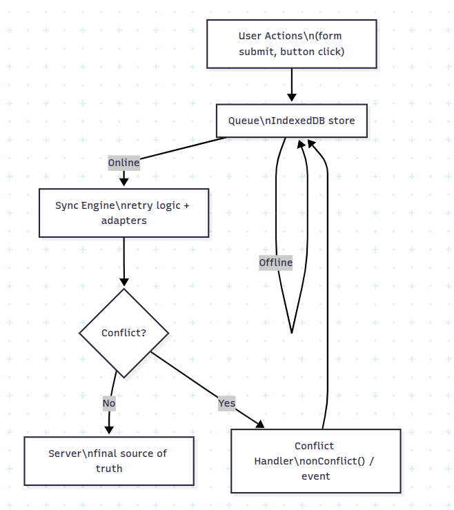

# Driftless

> **Your data never drifts away.**  
> Driftless is a framework-agnostic offline-first sync library with conflict handling and visual sync states.

[Npm Package Link](https://www.npmjs.com/package/driftless-sync?activeTab=readme)
---

## Features

- Offline-first UX – queue actions offline and auto-sync when back online
- Persistent storage – built on IndexedDB with UUID-based IDs
- Flexible sync adapters – REST available today, GraphQL & gRPC planned
- Conflict resolution – configurable via `onConflict` handler, supports:
  - Last-write-wins
  - Merge strategies
  - Manual user prompt
- Visual states – built-in hooks/components to show offline, queued, syncing, success, conflict
- Framework-agnostic – works with vanilla JS/TS, React, Angular, Vue, Svelte
- Enterprise-ready (planned) – audit logs, compliance helpers

---

## Architecture



---

## Installation

```bash
npm install driftless
# or
yarn add driftless
# or
pnpm add driftless
```

Optional framework bindings:

```bash
npm install @driftless/react
npm install @driftless/vue
npm install @driftless/angular
```

---

## Usage

### Core API

```ts
import { createSync } from 'driftless';
import { createRestAdapter } from 'driftless';

const adapter = createRestAdapter({ endpoint: '/api/orders' });

const sync = createSync({
  adapter,
  pollIntervalMs: 5000,
});

// Store offline actions
sync.store('order', { id: 1, status: 'pending' });

// Listen for sync events
sync.on('status', (status) => {
  console.log('Sync status:', status);
  // offline, queued, syncing, success, conflict
});
```

---

### React Example

```tsx
import { useSync } from '@driftless/react';

function OrderButton() {
  const { store, status } = useSync('orders', '/api/orders');

  return (
    <div>
      <button onClick={() => store({ item: 'wifi-pass' })}>Buy WiFi</button>
      <p>Status: {status}</p>
    </div>
  );
}
```

---

## Conflict Resolution

Driftless supports custom resolution strategies via the `onConflict` API:

```ts
sync.onConflict((local, remote) => {
  // Example: manual merge
  return {
    ...remote,
    notes: [...remote.notes, ...local.notes],
  };
});
```

If no handler is registered, Driftless emits a `conflict` event so the app can decide.

---


### 4. Inspecting the Queue

Driftless uses **IndexedDB** as its local storage engine.  
All queued items are stored under the database name **`driftless-db`** in the object store **`queue`**.

You can inspect and debug the queue directly in your browser:

1. **Open DevTools**
   - Chrome / Edge: `F12` → *Application* tab
   - Firefox: `F12` → *Storage* tab

2. **Navigate to IndexedDB**
   - Expand `IndexedDB` → `driftless-db` → `queue`

3. **View queued items**
   - Each entry is a JSON object of type `StoreItem`:
     ```json
     {
       "id": "8b31c7d2-4f42-4d77-bdb2-9245c35640e3",
       "type": "order",
       "payload": { "item": "wifi-pass" },
       "createdAt": 1694600000000,
       "version": 1
     }
     ```
   - `id`: unique UUID generated when the item is queued
   - `type`: logical namespace you passed to `store()`
   - `payload`: the actual data to sync
   - `createdAt`: timestamp (ms since epoch)
   - `version`: incremented on every conflict resolution retry

4. **Check sync flow**
   - When you go offline and call `store()`, the item will appear here.
   - When you come back online and sync succeeds, the item will be removed.
   - If there’s a conflict, the item will either:
     - be retried with a new `version` (if `onConflict` handled it), or
     - stay in the queue until you resolve it.

5. **Why inspect the queue?**
   - To debug issues where items don’t sync.
   - To confirm Driftless is persisting data offline.
   - To visualize how conflicts are retried and resolved.


---


## Package Structure

- `driftless` → core library (framework-agnostic)
- `@driftless/react` → React hooks + UI components
- `@driftless/vue` → Vue composables
- `@driftless/angular` → Angular service
- `@driftless/adapters` → REST (available), GraphQL/Firebase/Supabase (planned)

---

## Use Cases

- **Airlines**: Passenger buys WiFi offline, syncs later, conflict handled if purchased elsewhere
- **Healthcare**: Nurse logs vitals offline, syncs later, conflict if another nurse updated
- **Logistics**: Driver scans packages offline, syncs later, conflict if hub already processed
- **Retail**: Shopper adds items offline, cart merges smoothly when online

---

## Driftless vs Alternatives — Comparison Table

| Feature / Capability | Driftless | PouchDB + CouchDB Replication | RxDB | CRDTs (Yjs / Automerge) | Workbox + Background Sync | Firebase / Supabase Offline Features |
|---|---|---|---|---|---|---|
| Local queue of user actions | ✅ (IndexedDB, explicit queue) | ✅ (with CouchDB) | ✅ | ✅ (for CRDT-backed data) | ⚠️ (background sync queues raw requests, but limited visibility) | ✅ (for certain SDKs, e.g. Firestore offline) |
| UUID-based IDs / Versioning Metadata | ✅ | ✅ (via document revisions) | ✅ | ✅ | ❌ | ✅ (depending on backend) |
| Conflict detection / customizable conflict resolution | ✅ (via `onConflict` / event) | ✅ (manual resolution, CouchDB revision merge) | ✅ (some support) | ✅ (CRDT merges automatically) | ❌ / Very limited | ⚠️ (depends on product; sometimes “last write wins” or use optimistic concurrency) |
| Visibility & Inspectability of queued items | ✅ (can inspect IndexedDB queue) | Partial (replication logs, tools) | ✅ (reactive local DB) | ❌ / not for raw actions | ❌ (service worker under-the-hood) | Partial |
| Lightweight footprint | ✅ (designed to be minimal core + adapters) | Heavier (bundle + server replication support) | Heavier (reactivity, plugin layers) | Medium (for CRDT operations) | Lightweight for caching; lacks full conflict logic | Variable; SDKs tend to include a lot of features |
| Framework-agnostic | ✅ | ✅ | ✅ | Mostly, if adapted | ✅ for caching; data sync usually integrated per-framework | SDK tied, some frameworks only |
| Dependency on backend choices | Low — any backend that can respond with `ok` / `conflict` works | High — you typically need CouchDB or compatible server | Medium/High — replication plugin/backends required | High — need CRDT-aware servers or peers | Low for caching; high for data consistency | Medium — depends on backend features and SDK availability |
| UI state hooks / status support | ✅ (offline, queued, syncing, conflict, success) | Partial / custom | ✅ (if you build) | ❌ / needs extra work | ❌ (mostly invisible to UI) | ✅ (some SDKs provide) |
| Compliance / audit log friendliness | ✅ (versioning + metadata) | Medium (replication logs, but restructuring needed) | Medium | Medium-Low | Low | High (stores persistent data + metadata) |

---

### Key Takeaways

- **Where Driftless excels**:
  - Clear, inspectable local queue (IndexedDB)  
  - Conflict resolution via `onConflict` + custom merge  
  - Lightweight, framework-agnostic API  
  - Good metadata (UUIDs, versions) for auditing

- **Where alternatives may be better**:
  - If you already use CouchDB (PouchDB) and need live replication across devices  
  - If you need real-time collaborative editing (CRDTs like Yjs or Automerge)  
  - If your backend / product already includes offline SDKs (Firebase, Supabase) and you want to leverage those

---

## Roadmap

- [x] Core offline queue + retry (IndexedDB)
- [x] REST adapter
- [x] Conflict resolution strategies
- [ ] React/Vue/Angular bindings
- [ ] UI components for status & conflict dialogs
- [ ] GraphQL adapter
- [ ] Cloud sync connectors (Firebase, Supabase)
- [ ] Enterprise features (audit logs, compliance)

---

## Release Notes

**v0.1.0**

- Initial release
- IndexedDB queue with UUIDs
- REST adapter
- Conflict resolution API
- React hook (`useSync`)

---

## Contributing

Contributions are welcome!  
Please check the issues tab and open a discussion before working on large changes.

---

## License

MIT © Driftless Contributors
